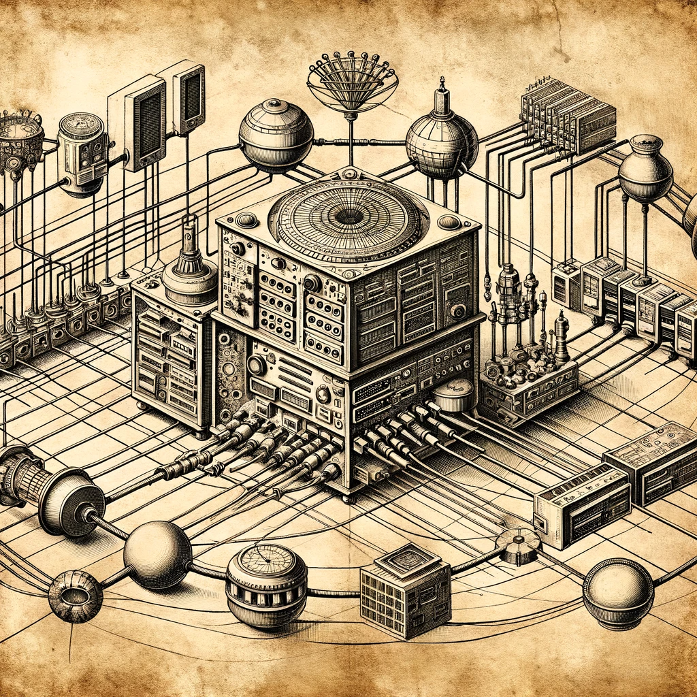

### Let's Connect!

Whether you're curious about my research in biotechnology and data science, interested in discussing potential collaborations, or have general inquiries, I'd love to hear from you! 

You can connect with me through various platforms:

- For quick updates and thoughts, follow me on [Twitter](https://twitter.com/MicrobialBart). I often share insights on microbial ecology, data science, and my journey through the ever-evolving landscape of biotechnology.
- To see my professional background and network with me, visit my [LinkedIn](https://www.linkedin.com/in/ryan-bartelme/). It's a great place to connect on a professional level and explore potential collaborative opportunities.
- For a closer look at my projects and contributions to the field, check out my [GitHub](https://github.com/rbartelme). Here, you can dive into the repositories of my past work and ongoing projects, including those related to Bayesian Belief Networks, controlled environment agriculture systems, and more.

---

Your interest and support are greatly appreciated, and I'm always open to engaging conversations and innovative ideas. Let's explore the possibilities together!
---

<figure class="centered-figure">
    
    <figcaption class="image-caption">
        Caption: <em>An Antoni van Leeuwenhoek hand drawn style image of a network</em>.  
        Image generated by DALL-E. 
        See the original prompt on my 
        <a href="https://github.com/rbartelme/rbartelme.github.io/blob/main/image_prompts/vanhoek.md">GitHub page</a>.
    </figcaption>
</figure>   
