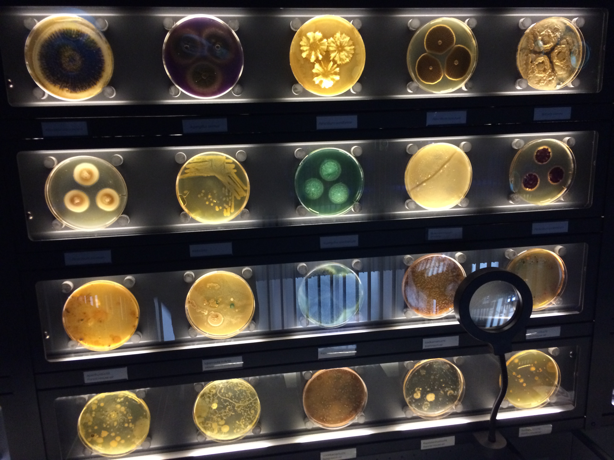

<link rel="stylesheet" href="styles.css" type="text/css">

## Data Scientist & Microbial Ecologist 
 

### *Application Driven, Microbially Rooted, Agricultural Data Science*

  

#### Data Science, Informatics, Edge Computing

  

#### Agriculture

  

#### Applied Microbial Ecology

  

         

Thank you to [Emily Zabor](https://www.emilyzabor.com/) for the github.io page build  [tutorial](https://www.emilyzabor.com/tutorials/rmarkdown_websites_tutorial.html) using [Rmarkdown](https://rmarkdown.rstudio.com/) and [Rstudio](https://rstudio.com/).