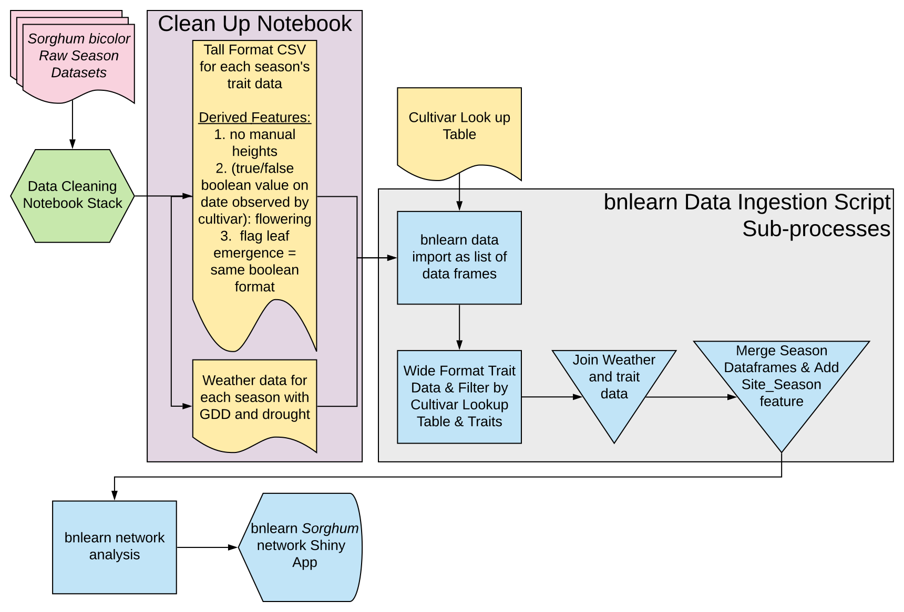

<link rel="stylesheet" href="styles.css" type="text/css">

---

### Modeling *Sorghum bicolor* Phenotypes with Bayesian Belief Networks

This [project](https://www.github.com/rbartelme/phenophasebbn/) is a research component of the [GenoPhenoEnvo NSF HDR award](https://genophenoenvo.github.io/). It's written in the R language and uses the Bayesian Network library `bnlearn` to construct diacyclic graphs for the phenotypic, genomic, and environmental data compiled by the [TERRA-REF Project](https://www.terraref.org/). The data and code are freely available on GitHub and, when the project is completed, the Docker container and data will be freely available to use on the [CyVerse Discovery Environment](https://de.cyverse.org/de/).

#### *An overview of the Bayesian Belief Network in the GenoPhenoEnvo code ecosystem:*

---

### Macroeclogical Predictive Modeling from Microbial Community Data

This is also associated with the [GenoPhenoEnvo NSF HDR award](https://genophenoenvo.github.io/). The project uses publicly available [NSF NEON](https://www.neonscience.org/) datasets to predict macroecological phenotypes from microbial data products. Project is in development  [here](https://www.github.com/rbartelme/NEON_metagenomics/).

#### *Overview of the data processing:*

---

### Microbial Communities in Controlled Environment Agriculture Systems

As a trained microbial ecologist and microbiologist, I am very interested in how microbial communities function. My doctoral work focused on recirculating aquaculture system microbiomes, as well as aquaponic microbiomes. Prior work in this area can be found [here](publications.html). This is an on-going interest that I am actively seeking funding to continue. 

---

### Online Short-Course in Statistics

Developed for the [University of Arizona Data Science Fellows Program](https://datascience.arizona.edu/data-science-fellows/) [this](https://github.com/rbartelme/rstudio-stats/) course uses the [CyVerse Discovery Environment](https://de.cyverse.org/de/) and [docker](https://www.docker.com/) to provide a brief introduction to statistical analyses in the R language for postdoctoral researchers in computer science and biology. Topics covered include basic regression, distribution modeling, markov chains, and Bayesian Belief Networks.
